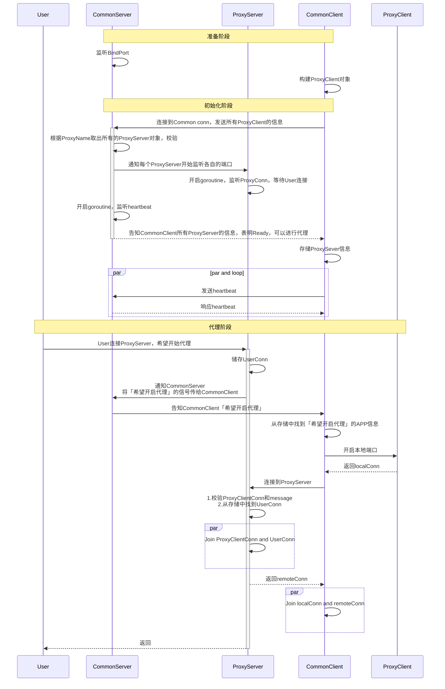
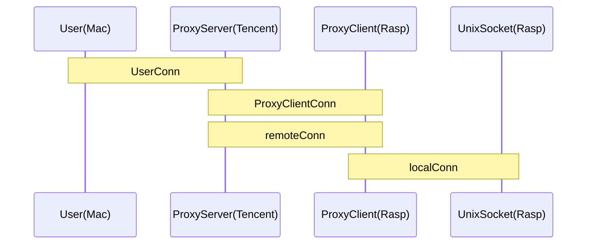

## 模仿frp的基于代理的内网穿透玩具

因为原版frp的可读性很差，故重构。


## Usage

Server：

```go
func main() {
	appServerList := []*consts.AppServer{
    {Name: "SSH", ListenPort: 6000, Password: "my_ssh_server_password"},
		{Name: "HTTP", ListenPort: 5000, Password: ""},
	}

	commonProxyServer, err := NewProxyServer("common", "0.0.0.0", 8888, appServerList)
	if err != nil {
		log.Error(errors.ErrorStack(err))
	}
	commonProxyServer.Run()
}
```

```bash
cd frps/
go run *.go
```


Client：

```go
func main() {
	appClientList := []*consts.AppClient{
		{Name: "SSH", LocalPort: 22, Password: "my_ssh_server_password"},
		{Name: "HTTP", LocalPort: 7777, Password: ""},
	}

	commonProxyClient, err := NewProxyClient("common", 5555, "0.0.0.0", 8888, appClientList)
	if err != nil {
		log.Error(errors.ErrorStack(err))
	}
	commonProxyClient.Run()
}
```

```bash
cd frpc/
go run *.go
```


User：

```bash
# ssh: 
# proxy 6000 to 22
ssh -o 6000 yourComputerName@127.0.0.1

# http: 
# proxy 5000 to 7777
python3 -m http.server 7777
curl 127.0.0.1:5000
```

## sequenceDiagram




## 两个Join操作



对于Tencent来说：

- UserConn：表示来自于Mac的TCP连接。
- ProxyClientConn：表示连接到Rasp某个服务的TCP连接。

对于Rasp来说：

- RemoteConn：表示来自于Tencent的TCP连接。
- LocalConn：表示本机某个服务的UnixSocket连接。

经过两个Join操作，ProxyClientConn、UserConn、remoteConn、UnixSocketConn都互相串通。也就实现了远程User与UnixSocket的连接，也就是Mac通过Tencent，连接到了Rasp。


